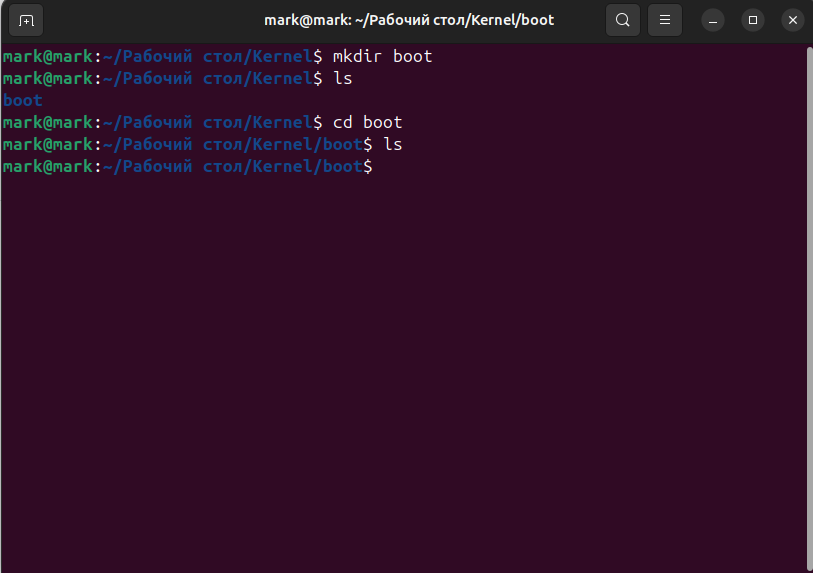

# Bootloader

A bootloader for UEFI, like a BIOS, is designed to boot the entire system and display configuration options for the kernel.

## Creating Your Own Bootloader

Creating your own bootloader for UEFI or BIOS takes over 10 years or more; creating a minimal, working bootloader takes several months. Therefore, we'll make do with the open-source bootloader from [Syslinux](https://github.com/geneC/syslinux)

## To get started

Before starting, you can read and look at the code for [Syslinux](https://github.com/geneC/syslinux) or even create your own or edit the one from **Syslinux** and compile it. If you're not interested, we'll use a pre-built bootloader for UEFI and BIOS.

# Create a structure before yours for the kernel itself.

#### To do this, create a boot or another name for Bootloader:

### Then copy the prepared files for UEFI and BIOS:

- In **boot**, enter:
> wget https://www.kernelstepbystep.pp.ua/bootloader/bootloader.txt

- Once you have the file:
> wget -x -nH --cut-dirs=1 -i bootloader.txt

- Once all the files and the structure have downloaded, delete the file with the links:
> rm bootloader.txt

**The resulting structure should contain the main files for loading BIOS (Syslinux), and for UEFI, there will be an EFI folder, then Boot, and then Syslinux for UEFI.**
